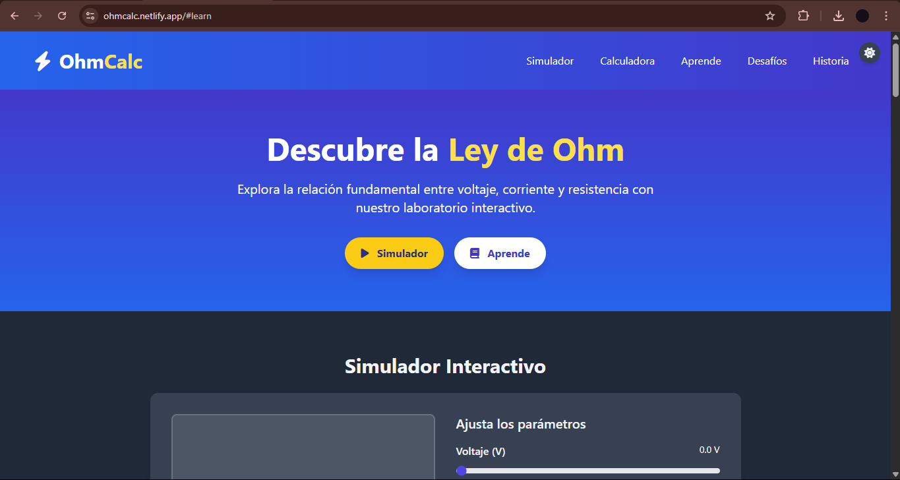
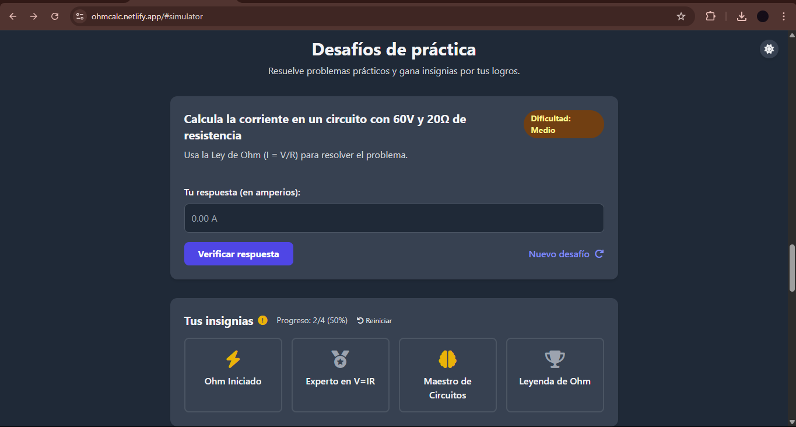

# OhmCalc

OhmCalc es una aplicación web interactiva para aprender, practicar y experimentar con la Ley de Ohm. Incluye simulador visual, calculadora avanzada, desafíos gamificados y recursos educativos, todo en una interfaz moderna y responsiva.

## Características principales

- **Simulador Interactivo:** Ajusta voltaje y resistencia con sliders y observa cómo cambia la corriente y el brillo de una bombilla virtual.
- **Calculadora de Ley de Ohm:** Calcula corriente, voltaje, resistencia o potencia, eligiendo unidades y obteniendo resultados instantáneos.
- **Desafíos y Gamificación:** Resuelve ejercicios de dificultad variable y desbloquea insignias por tus logros. El progreso se guarda en el navegador.
- **Sección Educativa:** Explicaciones, fórmulas, ejemplos y comparador de materiales conductores.
- **Modo Oscuro:** Alterna entre modo claro y oscuro fácilmente.
- **Recursos y enlaces:** Acceso a laboratorios virtuales y materiales de apoyo.

## Estructura del proyecto

```
└── ohmcalc/
    ├── README.md
    ├── index.html                # Página principal
    ├── LICENSE
    ├── images/
    ├── scripts/
    │  ├── script.js             # Lógica general, simulador y modales
    │  ├── calculadora.js        # Lógica de la calculadora de Ohm
    │  └── desafios.js              # Desafíos y gestión de insignias
    └── styles/
        └── style.css            # Estilos personalizados y animaciones
```

## Instalación y uso

1. **Descarga o clona el repositorio:**
   ```
   git clone https://github.com/Rpla2/OhmCalc
   ```
2. **Abre `index.html` en tu navegador favorito.**
   - No requiere instalación de dependencias ni servidor.

## Tecnologías utilizadas
- HTML5, CSS3 (TailwindCSS CDN + estilos propios)
- JavaScript (ES6)
- Font Awesome para iconos

## Créditos y licencia
- Desarrollado por Rpla2.
- Licencia: MIT

## Capturas de pantalla


## Contribuciones
¡Las contribuciones son bienvenidas! Puedes abrir issues o pull requests para sugerir mejoras o reportar errores.
